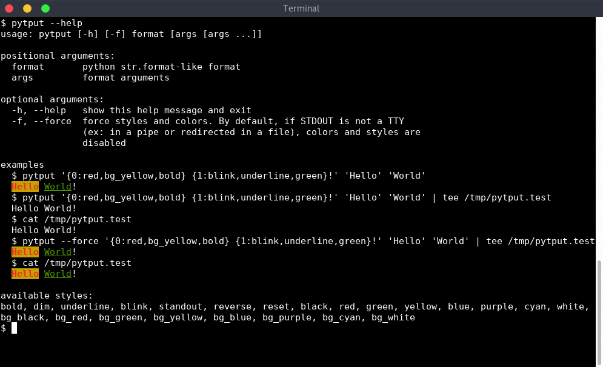
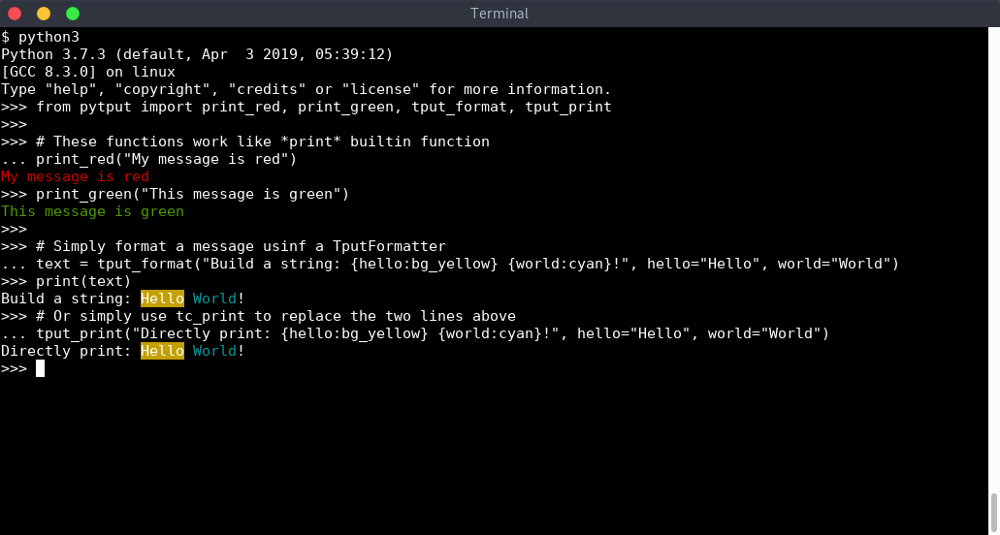

# PyTput

> TL;DR: You can format your message with `{message:bold,underline,purple}`
> 
Simple executable and *Python3 API* to format messages using colors and styles from `tput`:
- `pytput` executable to be used in any *shell-like* script
- *Python3* module to format messages directly in any python application




# Install

Install via `pip`:

```sh
# Install pip for python3
$ sudo apt install python3-pip
$ pip install pytput
```

Or you can clone the project and install it via `setup.py`:

```sh
# Install python3
$ sudo apt install python3 python3-setuptools
# Clone repository
$ git clone https://github.com/essembeh/pytput
$ cd pytput
# If you are in a virtualenv, install it with
$ python3 setup.py install
# or use --user if you want to install it in userland
$ python3 setup.py install --user
```

To setup a development environment:

```sh
$ git clone https://github.com/essembeh/pytput
$ cd pytput
$ make venv
$ source venv/bin/activate
(venv) $ make install # equivalent to ./setup.py install
(venv) $ make # To run the tests, coverage and flake8
(venv) $ make watch # to reinstall automatically if you modify the source code
```

# Usage

## Using a *TputFormatter* class
You can use the `TputFormatter` class to decorate variables with *styles*.

```python
from pytput import TputFormatter
tf = TputFormatter()

# Build a colored string and print it
text = tf.format("{hello:bg_yellow,bold} {world:cyan,underline}!", hello="Hello", world="World")
print(text)

# You can combine multiple styles and common str.format spec
text = tf.format("{hello:.2,bg_yellow,underline} {myvalue:04d,cyan}!", hello="Hello", myvalue=42)
print(text)
```


Here is the list of available styles

| Formatter keyword | Python enum     | tput command   |
| ----------------- | --------------- | -------------- |
| *bold*            | Style.BOLD      | `tput bold`    |
| *dim*             | Style.DIM       | `tput dim`     |
| *underline*       | Style.UNDERLINE | `tput smul`    |
| *blink*           | Style.BLINK     | `tput blink`   |
| *standout*        | Style.STANDOUT  | `tput smso`    |
| *reverse*         | Style.REVERSE   | `tput rev`     |
| *reset*           | Style.RESET     | `tput sgr0`    |
| *black*           | Style.BLACK     | `tput setaf 0` |
| *red*             | Style.RED       | `tput setaf 1` |
| *green*           | Style.GREEN     | `tput setaf 2` |
| *yellow*          | Style.YELLOW    | `tput setaf 3` |
| *blue*            | Style.BLUE      | `tput setaf 4` |
| *purple*          | Style.PURPLE    | `tput setaf 5` |
| *cyan*            | Style.CYAN      | `tput setaf 6` |
| *white*           | Style.WHITE     | `tput setaf 7` |
| *bg_black*        | Style.BG_BLACK  | `tput setab 0` |
| *bg_red*          | Style.BG_RED    | `tput setab 1` |
| *bg_green*        | Style.BG_GREEN  | `tput setab 2` |
| *bg_yellow*       | Style.BG_YELLOW | `tput setab 3` |
| *bg_blue*         | Style.BG_BLUE   | `tput setab 4` |
| *bg_purple*       | Style.BG_PURPLE | `tput setab 5` |
| *bg_cyan*         | Style.BG_CYAN   | `tput setab 6` |
| *bg_white*        | Style.BG_WHITE  | `tput setab 7` |


> Styles can be combined with `','` like `{message:underline,bold,yellow}`

> You can also reuse `string.Formatter` format specification like `{myint:05d,underline,bold,yellow}` or `{mystr:.10,underline,dim,red}`

## Using *format-like* and *print-like* functions

Some utility functions can be used to simply print lines with *styles*

```python
from pytput import print_red, print_green, tput_format, tput_print

# These functions work like *print* builtin function
print_red("My message is red")
print_green("This message is green")

# Simply format a message usinf a TputFormatter
text = tput_format("Build a string: {hello:bg_yellow} {world:cyan}!", hello="Hello", world="World")
print(text)
# Or simply use tc_print to replace the two lines above
tput_print("Directly print: {hello:bg_yellow} {world:cyan}!", hello="Hello", world="World")

```



## Using *pytput* executable

*PyTput* comes with an handy executable to use colors and styles directly from the command line. This is usefull to customize messages in shell scripts for example.

```sh
$ pytput '{0:red} {1:green}!' 'Hello' 'World'
$ pytput "{0:bold,red} {1:underline,dim,yellow} {2:bg_purple,yellow,blink}" "This is" "a message" "with styles ;)"
$ pytput "{0:red,bold,underline}" "Simple error message"
$ pytput "{0:bg_purple,white,bold}" "Another message"
```


> See `pytput --help` for more details.

## Disabling *pytput*

By default, *pytput API* is disabled if `sys.stdout.isatty()` is `False`, so you won't write any color nor style if you pipe the output or redirect it in a file.

Using `pytput` executable, you can force colors and styles using the `--force` argument.

```sh
# You get colors by default
$ pytput '{0:red} {1:green}!' 'Hello' 'World'
# Colors will be disabled
$ pytput '{0:red} {1:green}!' 'Hello' 'World' | cat 
$ pytput '{0:red} {1:green}!' 'Hello' 'World' > /tmp/pytput.txt
$ cat /tmp/pytput.txt
# Colors will be enabled
$ pytput --force '{0:red} {1:green}!' 'Hello' 'World' | cat 
$ pytput --force '{0:red} {1:green}!' 'Hello' 'World' > /tmp/pytput.txt
$ cat /tmp/pytput.txt
```


Using *pytput python3 API*, you can force styles and colors even if `sys.stdout` is not a TTY using `TputFormatter`:
```python
from pytput import TputFormatter, tput_print

# These lines won't have colors if you redirect stdout to a file
print(TputFormatter().format("{0:red} {1:green}!\n", "Hello", "World"))
tput_print("{0:red} {1:green}!\n", "Hello", "World"))

# These line will have colors even if stdout is redirected 
print(TputFormatter(check_tty=False).format("{0:red} {1:green}!\n", "Hello", "World"))
tput_print("{0:red} {1:green}!\n", "Hello", "World", check_tty=False))
```

You can totally disable `pytput` by setting `PYTPUT_DISABLE` variable in environment.
```sh
# Colors will be enabled
$ pytput '{0:red} {1:green}!' 'Hello' 'World'
# Colors will be disabled
$ PYTPUT_DISABLE=1 pytput '{0:red} {1:green}!' 'Hello' 'World'
```


> Note: If your program uses *pytput API* like the class `TputFormatter`, setting the environment variable `PYTPUT_DISABLE=1` will disable all colors and styles.