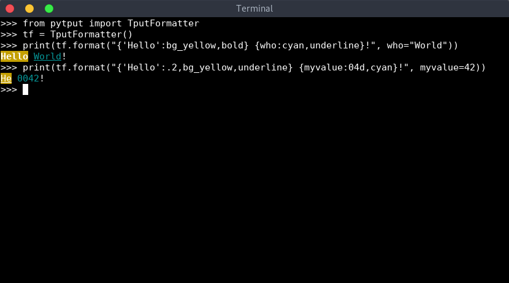
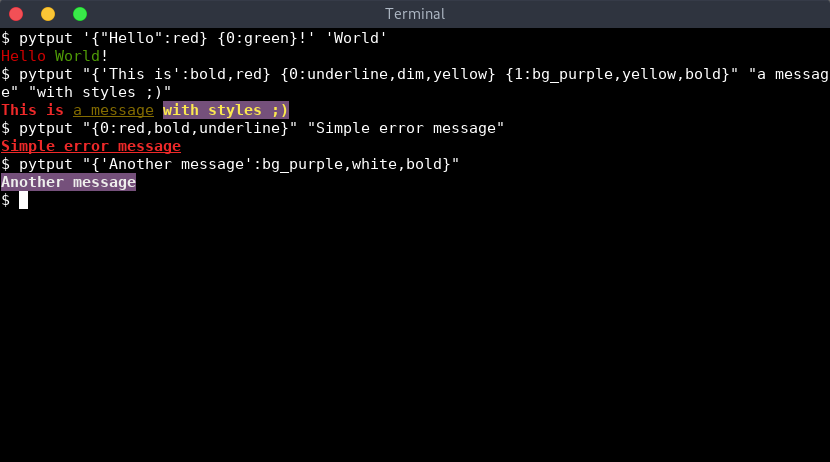
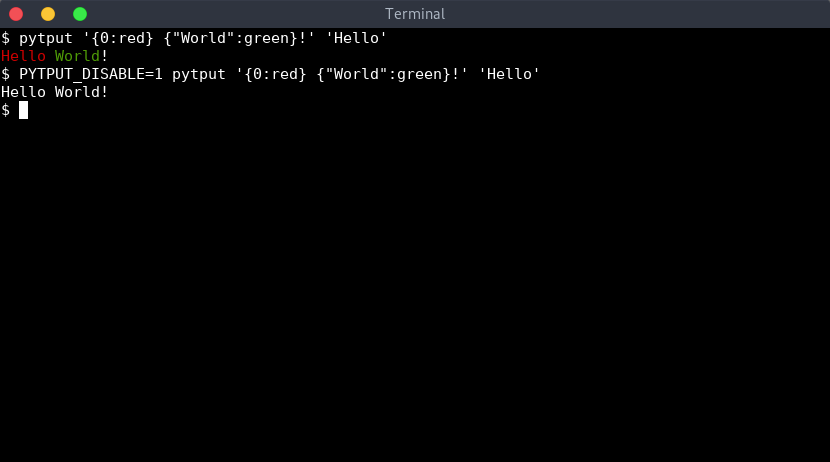

# PyTput

> TL;DR: You can format your message with `{message:bold,underline,purple}`
> 
Simple executable and *Python3 API* to format messages using colors and styles from `tput`:
- `pytput` executable to be used in any *shell-like* script
- *Python3* module to format messages directly in any python application


# Install

Install via `pip`:

```sh
# Install pip for python3
$ sudo apt install python3 python3-pip python3-setuptools
# Install from PyPI
$ pip3 install --user pytput
# ... Or directly from the sources
$ pip3 install --user git+https://github.com/essembeh/pytput
```

To setup a development environment:

```sh
$ git clone https://github.com/essembeh/pytput
$ cd pytput
$ make venv
$ make install
$ source venv/bin/activate
(venv) $ pytput --help
```

# Usage

## Using *tput_format* and *tput_print*

`tput_format` allow to format messages using *colors* and *styles*.
This is nothing more than a shortcut to use `TputFormatter`.

`tput_print` simply prints the message after formatting it.

```python
from pytput import tput_format, tput_print
# Create a format message
fmt = "Hello {who:red,bold}"
# You can print it
print(fmt)
# When formatting, styles are applied
a = tput_format(fmt, who="World")
print(a)
# Equivalent to
tput_print(fmt, who="World")
# And you can also use *constant* like {'today':bold} will be the string "today" with bold style applied
fmt += ", how are you {'today':green,underline}"
tput_print(fmt, who="User")
```


> Styles can be combined with `','` like `{message:underline,bold,yellow}`

> You can also reuse `string.Formatter` format specification like `{myint:05d,underline,bold,yellow}` or `{mystr:.10,underline,dim,red}`

> You can apply a style to constant strings with `{'today':bold}` or `{"today":bold}`

## Using a *TputFormatter* class

You can use the `TputFormatter` class to decorate variables with *styles*.

```python
from pytput import TputFormatter
tf = TputFormatter()
# Build a colored string and print it
print(tf.format("{'Hello':bg_yellow,bold} {who:cyan,underline}!", who="World"))
# You can combine multiple styles and common str.format spec
print(tf.format("{'Hello':.2,bg_yellow,underline} {myvalue:04d,cyan}!", myvalue=42))
```



Here is the list of available styles

| Formatter keyword | tput command   |
| ----------------- | -------------- |
| *bold*            | `tput bold`    |
| *dim*             | `tput dim`     |
| *underline*       | `tput smul`    |
| *blink*           | `tput blink`   |
| *standout*        | `tput smso`    |
| *reverse*         | `tput rev`     |
| *reset*           | `tput sgr0`    |
| *black*           | `tput setaf 0` |
| *red*             | `tput setaf 1` |
| *green*           | `tput setaf 2` |
| *yellow*          | `tput setaf 3` |
| *blue*            | `tput setaf 4` |
| *purple*          | `tput setaf 5` |
| *cyan*            | `tput setaf 6` |
| *white*           | `tput setaf 7` |
| *bg_black*        | `tput setab 0` |
| *bg_red*          | `tput setab 1` |
| *bg_green*        | `tput setab 2` |
| *bg_yellow*       | `tput setab 3` |
| *bg_blue*         | `tput setab 4` |
| *bg_purple*       | `tput setab 5` |
| *bg_cyan*         | `tput setab 6` |
| *bg_white*        | `tput setab 7` |


## Directly use *Style*


```python
from pytput import Style
print(Style.RED.apply("Hello"), Style.GREEN.apply("World"))
```


## Using *pytput* executable

*PyTput* comes with an handy executable to use colors and styles directly from the command line. This is usefull to customize messages in shell scripts for example.

```sh
$ pytput '{"Hello":red} {0:green}!' 'World'
$ pytput "{'This is':bold,red} {0:underline,dim,yellow} {1:bg_purple,yellow,bold}" "a message" "with styles ;)"
$ pytput "{0:red,bold,underline}" "Simple error message"
$ pytput "{'Another message':bg_purple,white,bold}"
```



> See `pytput --help` for more details.

## Disabling *pytput*

By default, *pytput API* is disabled if `sys.stdout.isatty()` is `False`, so you won't write any color nor style if you pipe the output or redirect it in a file.

Using `pytput` executable, you can force colors and styles using the `--force` argument.

```sh
# You get colors by default
$ pytput '{0:red} {"World":green}!' 'Hello'
# Colors will be disabled
$ pytput '{0:red} {"World":green}!' 'Hello' | cat 
$ pytput '{0:red} {"World":green}!' 'Hello' > /tmp/pytput.txt
$ cat /tmp/pytput.txt
# Colors will be enabled
$ pytput --force '{0:red} {"World":green}!' 'Hello' | cat 
$ pytput --force '{0:red} {"World":green}!' 'Hello' > /tmp/pytput.txt
$ cat /tmp/pytput.txt
```


Using *pytput python3 API*, you can force styles and colors even if `sys.stdout` is not a TTY using `TputFormatter`:
```python
from pytput import TputFormatter, tput_print

# These lines won't have colors if you redirect stdout to a file
print(TputFormatter().format("{0:red} {'World':green}!", "Hello"))
tput_print("{0:red} {'World':green}!", "Hello"))

# These line will have colors even if stdout is redirected 
print(TputFormatter(check_tty=False).format("{0:red} {'World':green}!", "Hello"))
tput_print("{0:red} {'World':green}!", "Hello", check_tty=False))
```

You can totally disable `pytput` by setting `PYTPUT_DISABLE` variable in environment.
```sh
# Colors will be enabled
$ pytput '{0:red} {"World":green}!' 'Hello'
# Colors will be disabled
$ PYTPUT_DISABLE=1 pytput '{0:red} {"World":green}!' 'Hello'
```


> Note: When using *pytput API* (`tput_print`, `TputFormatter` ...), setting the environment variable `PYTPUT_DISABLE=1` will also disable all colors and styles.